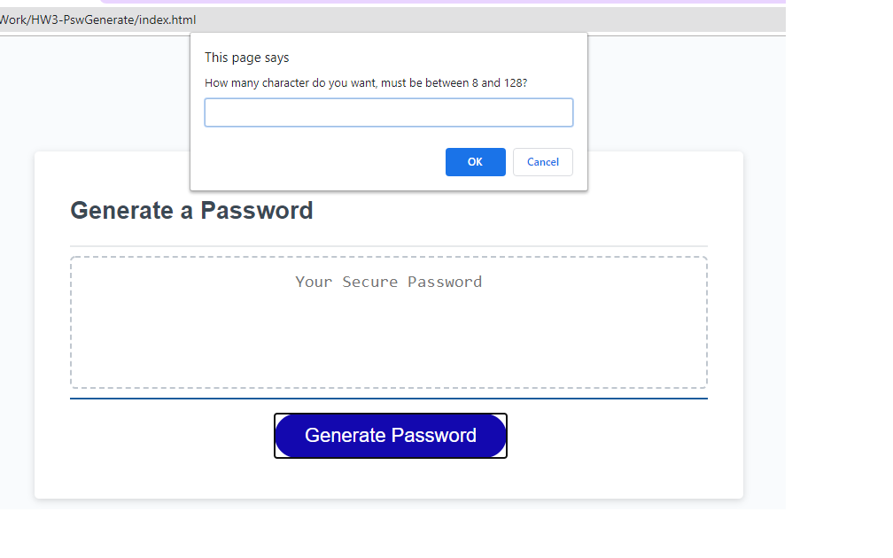
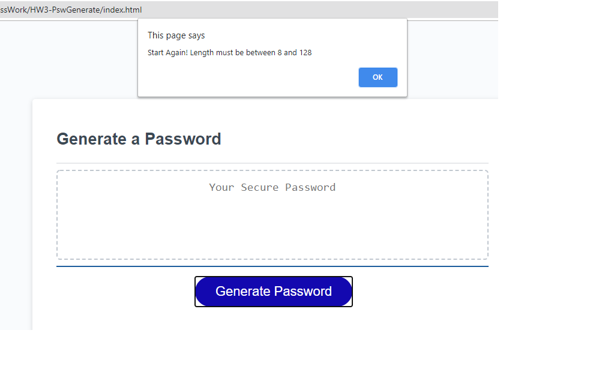
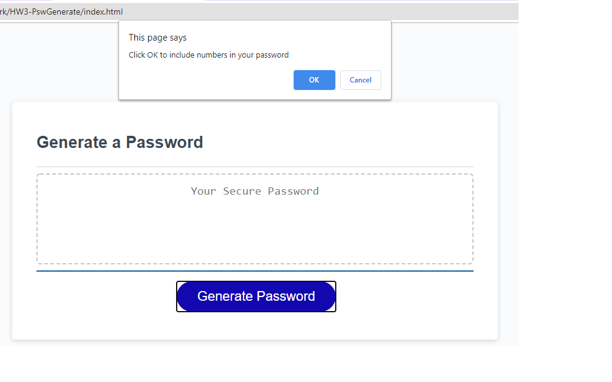
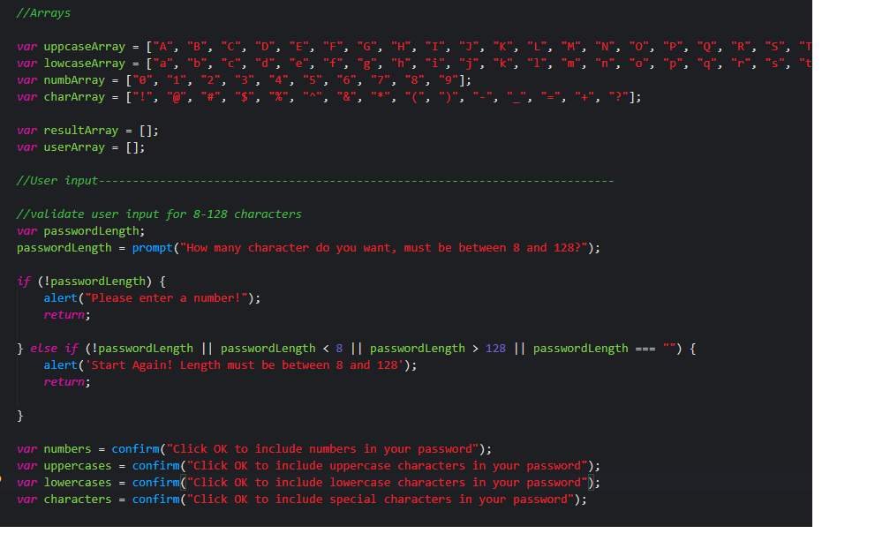

This application generates a random password based on user input and prompted inclusive criteria. Javascript was used to provide the confirmation input as well as the prompted input. Javascript was also used to validate prompted input. 

Application Criteria:

GIVEN I need a new, secure password
WHEN I click the button to generate a password
THEN I am presented with a series of prompts for password criteria
WHEN prompted for password criteria
THEN I select which criteria to include in the password
WHEN prompted for the length of the password
THEN I choose a length of at least 8 characters and no more than 128 characters
WHEN prompted for character types to include in the password
THEN I choose lowercase, uppercase, numeric, and/or special characters
WHEN I answer each prompt
THEN my input should be validated and at least one character type should be selected
WHEN all prompts are answered
THEN a password is generated that matches the selected criteria
WHEN the password is generated
THEN the password is either displayed in an alert or written to the page

Length of password - the user is prompted to input a number between 8 and 128. Validation requires that the number can't be omitted as well as a second validation for length. This is accomplished through a javascript if else if condition. 

The user is then presented with an OK or Cancel to stipulate the additional password criteria. 
lower case letters
uppercase letters
numbers
symbols

The application generates the random password after all of the selection criteria is complete. The random password is then written to the screen.

I have changed the button color from the original markup just to add a little punch. 
Using javascript arrays enables the creation of random numbers, letters and symbols.

 
Finished Product:

